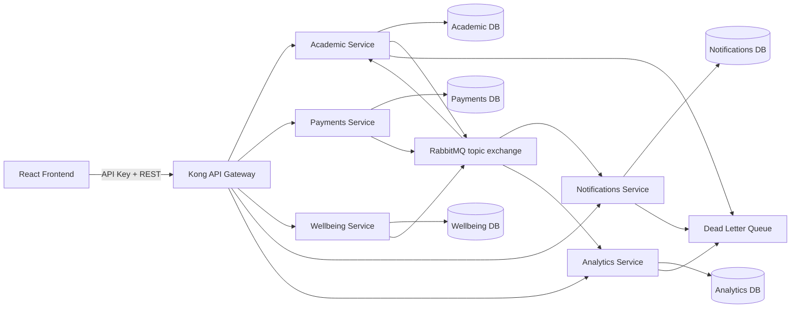
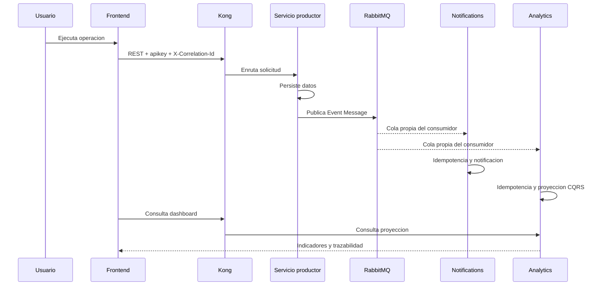

# Arquitectura funcional de CampusConnect 360

## Problema y alcance

CampusConnect 360 integra los procesos academicos, financieros y de bienestar
de una red de colegios. La solucion evita registros aislados y permite que una
accion operativa actualice notificaciones, analitica y estado financiero de
forma asincrona y trazable.

El alcance implementado incluye registro y consulta de estudiantes, creacion y
confirmacion de pagos, asistencia, incidentes, notificaciones simuladas,
proyeccion analitica y dashboard directivo.

## Actores

- Secretaria Academica registra y consulta estudiantes.
- Finanzas crea obligaciones y confirma pagos.
- Docente o Bienestar registra asistencia e incidentes.
- Direccion consulta indicadores y estado del ecosistema.
- Equipo tecnico inspecciona Swagger, logs, RabbitMQ y la DLQ como apoyo.

## Diagrama de componentes

## Flujo de eventos

## Servicios y persistencia

| Servicio | Responsabilidad | Persistencia |
|---|---|---|
| Academic | Estudiantes, matricula y estado financiero | `academic_db` |
| Payments | Obligaciones y confirmaciones de pago | `payments_db` |
| Wellbeing | Asistencia e incidentes | `wellbeing_db` |
| Notifications | Notificaciones simuladas y auditoria de consumo | `notifications_db` |
| Analytics | Proyeccion consolidada y auditoria de eventos | `analytics_db` |

SQLAlchemy mantiene los modelos de aplicacion y cada servicio conserva la
propiedad exclusiva de su base. Docker Compose crea volumenes independientes.

## APIs

| Prefijo de Kong | Operaciones principales |
|---|---|
| `/academic` | CRUD `/students` |
| `/payments` | CRUD `/payments` |
| `/wellbeing` | CRUD `/attendance` y `/incidents` |
| `/notifications` | GET `/notifications` y `/processed-events` |
| `/analytics` | GET `/analytics-events` y `/processed-events` |

FastAPI publica OpenAPI y Swagger en `/docs` de cada puerto de servicio. Las
operaciones del frontend siempre atraviesan Kong.

## Contratos de eventos

Los cuatro eventos obligatorios son `StudentEnrolled`, `PaymentConfirmed`,
`AttendanceRecorded` e `IncidentReported`. Todos incluyen:

- `eventId` unico;
- `eventType`;
- `occurredAt` en UTC;
- `correlationId`;
- objeto `data` con la entidad y datos relevantes.

Los JSON Schema versionados se encuentran en `contracts/events`.

## Patrones aplicados

- **API Gateway:** Kong centraliza rutas, CORS y API Key.
- **Publish/Subscribe:** Notifications y Analytics tienen colas diferentes
  enlazadas al mismo exchange y reciben una copia de cada evento aplicable.
- **Point-to-Point:** `academic.payment-confirmed.queue` tiene un unico
  consumidor responsable de actualizar el estado financiero.
- **Message Channel:** routing keys y colas nombradas por responsabilidad.
- **Event Message:** contratos con metadatos y datos de negocio.
- **Message Translator:** cada handler transforma el evento en Notification o
  AnalyticsEvent.
- **Idempotent Receiver:** `processed_events.event_id` evita efectos repetidos.
- **Dead Letter Channel:** rechazos no recuperables terminan en la DLQ.
- **CQRS:** Analytics almacena una vista de lectura separada del dominio.
- **Health Check:** todos los servicios y contenedores tienen comprobaciones.

## Seguridad

Kong exige la API Key `apikey` en las cinco rutas de negocio y oculta la
credencial antes de reenviar. CORS solo permite el origen local del frontend.
La clave incluida es exclusiva para la demostracion local; no es un mecanismo
de autenticacion apto para produccion.

## Resiliencia e idempotencia

Los consumidores usan ack manual y `prefetch_count=1`. Las colas activas
declaran el Dead Letter Exchange. Un JSON invalido o evento no procesable se
rechaza sin requeue; los mensajes duplicados se confirman sin ejecutar de nuevo
el handler. Los consumidores reconectan con RabbitMQ despues de una falla de
conexion.

`scripts/smoke_test.py` demuestra tanto la DLQ como la idempotencia con eventos
reproducibles.

## Observabilidad y trazabilidad

Los logs registran `eventId`, `eventType`, `correlationId`, routing key y estado.
Las tablas `processed_events` conservan intentos, fecha procesada, fecha de
falla y ultimo error. El dashboard diferencia indisponibilidad HTTP de fallas
asincronas.

## Dashboard e integracion de datos

Analytics implementa la proyeccion de lectura alimentada por eventos. El
dashboard combina esa proyeccion con las APIs operativas y muestra estudiantes,
pagos confirmados y pendientes, asistencias, incidentes, eventos procesados,
mensajes fallidos, notificaciones y estado general.

## Limitaciones conocidas

- La API Key esta embebida en el bundle de demostracion.
- La publicacion del evento ocurre despues del commit y no usa Transactional
  Outbox; una caida exacta entre ambas operaciones requiere recuperacion manual.
- Las modificaciones de esquema se realizan con SQL inicial y ajustes de
  arranque, no con una herramienta formal de migraciones.
- La ejecucion objetivo es local mediante Docker Compose.

## Mejoras futuras

- Autenticacion JWT con roles por actor.
- Transactional Outbox y reintentos con backoff.
- Migraciones con Alembic.
- Metricas Prometheus, trazas OpenTelemetry y alertas.
- Despliegue administrado con secretos externos.
